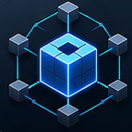

  

# About me
My name is DarkBladeDev. I am a 18-year-old backend developer with a strong focus on building Minecraft networks and developing custom plugins.

I specialize in creating efficient, scalable backend systems that enhance multiplayer experiences. My work is dedicated to improving server performance, creating innovative gameplay features, and ensuring high-quality, reliable solutions for Minecraft communities.

I am always eager to learn new technologies, refine my skills, and take on challenging projects. Thank you for visiting my profile — I look forward to sharing my journey with you!

# My Stats

  

# Stack

  
  
(Git, Github, Java, Maven, Python, PostgresSQL)

# Main Projects

<table>
  <tr>
    <td align="center">
       
      <b>DataLens</b> 
      <a href="https://modrinth.com/plugin/datalens" target="_blank">Download</a> |
      <a href="https://github.com/Parallax-Development/DataLens" target="_blank">GitHub</a> 
    </td>
    <td align="center">
       
      <b>MultiblockEngine</b> 
      <a href="https://modrinth.com/plugin/mbe" target="_blank">Download</a> |
      <a href="https://github.com/Parallax-Development/MultiBlockEngine" target="_blank">Github</a> 
    </td>
    <td align="center">
       
      <b>InputEngine</b> 
      <a href="https://modrinth.com/plugin/inputengine" target="_blank">Download</a> |
      <a href="https://github.com/DarkBladeDev/InputEngine" target="_blank">Github</a> 
    </td>
  </tr>
</table>

# Contact me

  <a href="mailto:darkbladedev@gmail.com">
  <a href="https://discord.com/users/835986372594630706">

